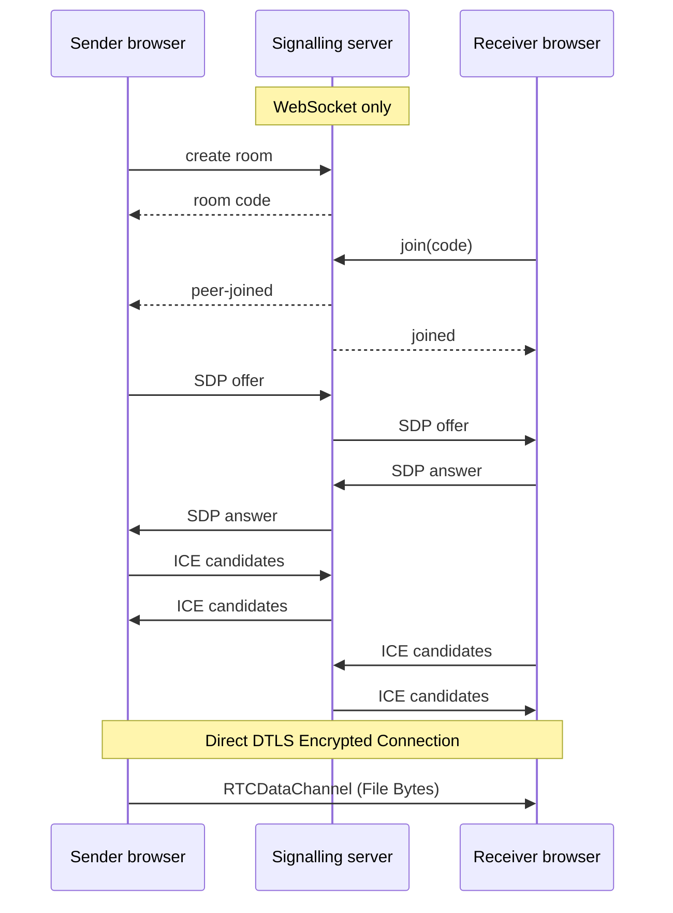

# Tether

A peer-to-peer file transfer web application. Two browsers connect directly over WebRTC and send files to each other. The server only introduces the two browsers; file bytes never pass through it and nothing is ever stored.

## Architecture

Tether strictly separates connection signaling from file data transfer. The server acts as a lightweight rendezvous point, expiring rooms after 10 minutes. Files are streamed completely peer-to-peer using WebRTC `RTCDataChannel`.



## Local Setup

Tether uses a monorepo structure. Ensure you have Node.js 18+ installed.

1. Clone the repository and install dependencies:
```bash
cd client && npm install
cd ../server && npm install
```

2. Start both the client and signaling server concurrently:
```bash
npm run dev
```

The Vite dev server will host the frontend at `http://localhost:5173` (or similar) and expose it to your local network, allowing you to test mobile scanning natively over Wi-Fi. The signaling server runs on `ws://localhost:8080`.

## Environment Variables

Tether relies on STUN/TURN servers to penetrate NAT and establish connections across restrictive networks. By default, Tether uses Google's public STUN server. To guarantee connectivity across strict firewalls (like corporate networks), you must provide TURN credentials.

Create a `.env` file in the `client/` directory:

```env
VITE_TURN_URL=turn:global.turn.twilio.com:3478
VITE_TURN_USERNAME=your_username
VITE_TURN_CREDENTIAL=your_credential
```

The app will automatically gracefully degrade to STUN-only if these are absent.

## Deployment Notes

Tether requires two distinct deployments: one for the static frontend and one for the active Node WebSocket server.

### 1. The Frontend (Static Host)
The `client` directory can be deployed to any static host (Vercel, Netlify, Cloudflare Pages, GitHub Pages). 

**Build Command:** `npm run build`
**Publish Directory:** `dist`

*Note: Ensure you set the `VITE_TURN_*` environment variables in your hosting provider's dashboard.*

### 2. The Signaling Server (Node Host)
The `server` directory requires a long-running Node.js process and must be deployed to a platform that supports WebSockets (Render, Fly.io, Heroku, DigitalOcean).

**Start Command:** `npm run start`

*Note: In a production environment, you should modify the client's `usePeerConnection` hook to point to your deployed `wss://...` URL instead of `ws://localhost:8080`.*
